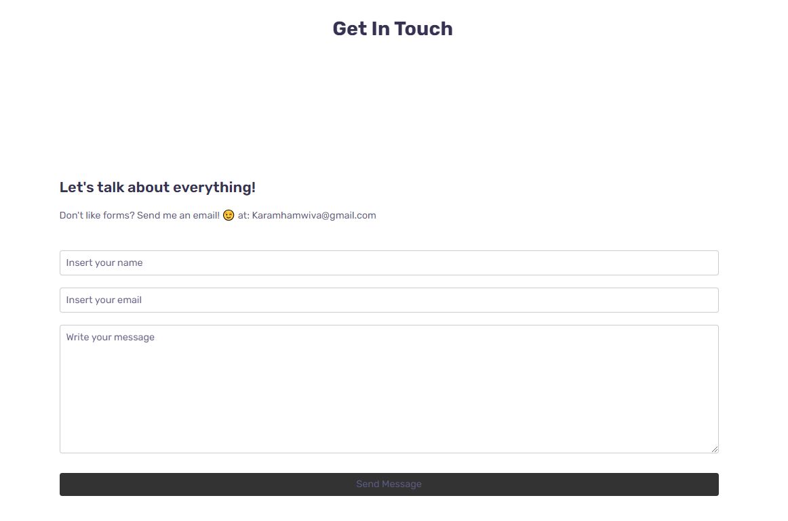

# personal-portfolio

# Introduction
Welcome to my Responsive Personal Portfolio page! 

We shall get started on my creation. 

We made a navbar on the side, and upon clicking on items of the bar, it will scrolldown to the desired destinations. (about me / services / contact etc...)

# Sections of the portfolio: 

# Home section: 

This website comes in a lightmode by default, then there is the option to turn it to dark mode where the entire website with the sections gets converted to dark mode. as in this picture below:

# About me section: 

It has my image and a link to all my social medias! so you can access me at all times. it also has access to my Github and my Linkedin! (Twitter link coming soon when i create an account...)

# Services section: 

This section contains some of my skillset and services that i would like to offer you for having me.

# Projects section:

This section contains some of my projects that I have worked on. upon hovering on the images, it makes them larger.
UPDATED: now upon clicking on them, it shall direct you to the website that is connected with it.

# Contact section:

If you dont like using forms? you can send me an email at KaramHamwiva@gmail.com. 

there is also a form anyways if you would prefer using this. 

Once filled up with all the information and Submitted the user should see a confirmation message.

# Conclusion:

I had a blast working on this project, ofcourse many more changes to come and modify, it will be an on-going improvement website!

